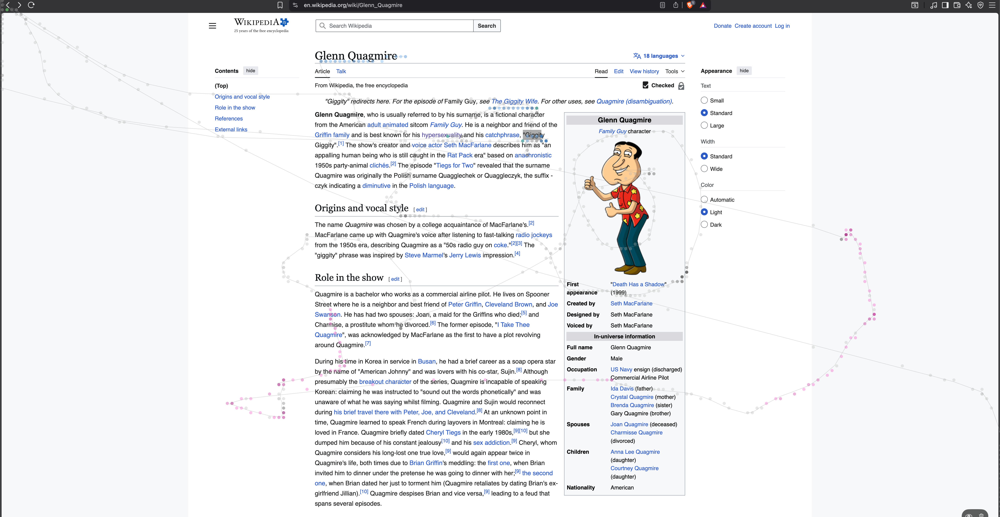

# DriftMap

DriftMap is a macOS app that records where your cursor goes and renders it as a live, app-aware heatmap drawn directly on top of your screen. Movement, clicks, drags, and scrolls are captured continuously and painted as a transparent overlay across every connected display, so you can see your interaction patterns in real time.



## Features

- **Live overlay heatmap** — a transparent, click-through overlay is drawn over every monitor, updating as you work. Enabled by default at launch.
- **Interaction-aware colors** — each interaction type has its own hue, grouped into readable families:
  - **Movement** — neutral gray (background layer)
  - **Clicks** — green (left), red (right), amber (middle)
  - **Drags** — blue (left), indigo (right), violet (middle)
  - **Scroll** — magenta
- **Intensity by repetition** — every cell's depth is driven by how many times the spot was hit, mapped across a 20-shade ramp. Clicking or revisiting the same place repeatedly makes it visibly hotter.
- **Cursor route trail** — a thin gray line traces the actual path the cursor traveled.
- **App & display attribution** — each sample is tagged with the foreground app and the display it occurred on, so heatmaps can be scoped per app and per monitor.
- **Floating controls** — a small capsule anchored to the bottom-right corner of whichever monitor your cursor is on, with:
  - an **eye** toggle to enable/disable the overlay
  - a **trash** button to clear all recorded samples
- **Self-aware capture** — DriftMap never records cursor activity that happens over its own controls window.
- **Multi-monitor** — overlays and capture geometry follow each screen's frame independently.

## Requirements

- macOS 14 or newer
- Xcode 26 or newer
- Swift 6

## Permissions

DriftMap observes mouse events system-wide using global event monitors, which require **Accessibility** access:

1. Open **System Settings → Privacy & Security → Accessibility**.
2. Enable DriftMap (or the terminal/Xcode you launch it from during development).

Without this permission, clicks, drags, and scrolls outside DriftMap's own windows will not be captured.

## Development

Build the app:

```sh
make build
```

Run tests:

```sh
make test
```

Launch the app from SwiftPM:

```sh
make run
```

## Usage

1. Launch DriftMap. The overlay starts active and the floating control capsule appears at the bottom-right of the active monitor.
2. Move, click, drag, and scroll as you normally would — the heatmap builds up live.
3. Use the **eye** button to toggle the overlay on/off, and the **trash** button to clear the accumulated heatmap.
4. The control capsule follows your cursor across monitors, always anchoring to the active display's bottom-right corner.

## Project Structure

- `Sources/DriftMap/App` — app entry point (`DriftMapApp`) and `AppDelegate`.
- `Sources/DriftMap/Views` — SwiftUI views: `ContentView`, `FloatingControls`, `HeatmapPreview`/`HeatmapCanvas` (rendering + color palette), and `WindowConfigurator` (positions the borderless controls window on the active monitor).
- `Sources/DriftMap/ViewModels` — `HeatmapPreviewViewModel`: capture timers, global/local event monitors, sample storage, and overlay lifecycle.
- `Sources/DriftMap/Overlay` — `OverlayWindowCoordinator`: creates the per-display transparent overlay panels.
- `Sources/DriftMapCore` — platform-agnostic core: `CursorSample`, `CursorInteractionType`, `HeatmapAccumulator`, `HeatmapCell`, `HeatmapConfiguration`.
- `Tests/DriftMapCoreTests` — unit tests for the heatmap aggregation logic.

## How Capture Works

- A 30 Hz timer samples the cursor position for **movement**; consecutive identical points are de-duplicated.
- Global and local `NSEvent` monitors capture discrete **click**, **drag**, and **scroll** events.
- Each sample stores both its mapped position and a normalized (0–1) position so it can be re-rendered at any canvas size.
- `HeatmapAccumulator` bins samples into a grid of cells, counting hits per cell; the renderer maps each cell's hit count onto the 20-shade color ramp for its interaction type.

## Roadmap

- Per-app and per-display heatmap filtering in the UI.
- Export heatmap overlays as images or video.
- A real Settings panel (capture rate, sample cap, color themes).
